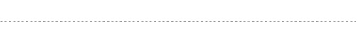

   
  
   
   

<link rel="stylesheet" type="text/css" href="https://stackpath.bootstrapcdn.com/bootstrap/4.2.1/css/bootstrap.min.css">

&nbsp;&nbsp;&nbsp;&nbsp;&nbsp;&nbsp;&nbsp;&nbsp;&nbsp;&nbsp;&nbsp;&nbsp;&nbsp;&nbsp;&nbsp;&nbsp;&nbsp;&nbsp;&nbsp;&nbsp;&nbsp;&nbsp;&nbsp;&nbsp;&nbsp;&nbsp;&nbsp;&nbsp;&nbsp;&nbsp;&nbsp;&nbsp;&nbsp;&nbsp;&nbsp;&nbsp;&nbsp;&nbsp;&nbsp;
&nbsp;&nbsp;&nbsp;&nbsp;&nbsp;&nbsp;&nbsp;&nbsp;&nbsp;&nbsp;&nbsp;&nbsp;&nbsp; 
  ]

# Overview

The SuperAPI team monitors the internet for information about data breaches. Currently, our database contains information about over 12B compromised user accounts. Your applications can access this information via SuperAPI.

   
  
   

## Getting started

Before using SuperAPI, make sure you've registered at [SuperAPI portal](https://superapi.com) so you can use [the unique API key](https://github.com/vissaly/brapi/blob/master/docs/get-api-key.md). 

When you use SuperAPI, include the API key to each request header. 

## Testing SuperAPI

SuperAPI can be tested using various automation tools.

SuperAPI request schema for Postman is available at the link below.

https://www.getpostman.com/collections/123456

The following parameters can be specified via the test environment.

| PARAMETER | VALUE | COMMENTS |
| ------ | ------ | ------ |
| BASE_URL | `https://superapi.com` |  |
| API_KEY | `your-secret-key` | See [Generating the API key](https://github.com/vissaly/brapi/blob/master/docs/get-api-key.md) for details. |

## How to Use SuperAPI

* [Check Email Addresses and Domains]()
* [Register Email Addresses and Domains]()
* [Monitor Email Addresses and Domains]()
* [Configure the Postback URL and Be Updated]()

## Contact 

If you need help integrating with Breach Report API or need additional information, don't hesitate to contact us on:

* Telegram
* Stackoverflow
* Twitter

Or email us at info@breachreport.com.
If you want to report a security issue, include the word "security" in the subject field.

We take security issues very seriously and we'll be looking forward to hearing from you. Still, we hope you enjoy using KeyChain and the integration goes smooth!

## License 

   
  

## Response Codes

| Code | Name | Description |
| ------ | ------ | ------ |
| 200 | OK | Request successfully passed. |
| 400 | Bad Request | Invalid domain URL. Please check the Base URL value. |
| 401 | Unauthorized | The `API-Key` value is invalid or is missing from the header. Make sure that you have generated one at [Portal](https://breachreport.com/portal/user-api) section. |
| 402 | Payment required | You may need to upgrade your subscription. For further information, visit the [Subscription](https://breachreport.com/portal/subscriptions) page. |
| 409 | Conflict | The domain name or the email address was registered before. Check your account for existing domains / emails. |
| 500 | Internal server error | Internal server error occured. If this issue persists, contact our Support Service. |