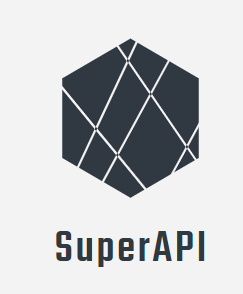
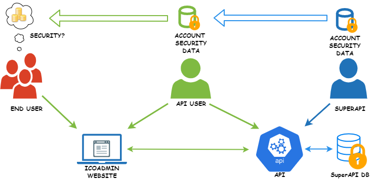

<p align="center">
  <br>
  
  <br>
  <br>
</p>

<link rel="stylesheet" type="text/css" href="https://stackpath.bootstrapcdn.com/bootstrap/4.2.1/css/bootstrap.min.css">

&nbsp;&nbsp;&nbsp;&nbsp;&nbsp;&nbsp;&nbsp;&nbsp;&nbsp;&nbsp;&nbsp;&nbsp;&nbsp;&nbsp;&nbsp;&nbsp;&nbsp;&nbsp;&nbsp;&nbsp;&nbsp;&nbsp;&nbsp;&nbsp;&nbsp;&nbsp;&nbsp;&nbsp;&nbsp;&nbsp;&nbsp;&nbsp;&nbsp;&nbsp;&nbsp;&nbsp;&nbsp;&nbsp;&nbsp;
&nbsp;&nbsp;&nbsp;&nbsp;&nbsp;&nbsp;&nbsp;&nbsp;&nbsp;&nbsp;&nbsp;&nbsp;&nbsp;[](https://twitter.com/intent/tweet?text=A%20good,%20solid%20app%20to%20keep%20your%20keys%20safe.&url=https://keychain.array.io/&via=ProjectArray&hashtags=cybersecurity,private,cryptography,blockchain,app) [](https://github.com/arrayio/array-io-keychain#contributing-to-the-project)
[](https://github.com/arrayio/array-io-keychain/blob/master/LICENSE.md) [](https://badge.fury.io/js/keychain.js) ]

## Overview

The SuperAPI team monitors the internet for information about data breaches. Currently, our database contains information about over 12B compromised user accounts. Your applications can access this information via SuperAPI.

<p align="center">
  <br>
  
  <br>
</p>


## Getting started

Before using SuperAPI, make sure you've registered at [SuperAPI portal](https://superapi.com) so you can use [the unique API key](https://github.com/vissaly/brapi/blob/master/docs/get-api-key.md). 

When you use SuperAPI, make sure to include the API key to each request header. 

## Testing SuperAPI

SuperAPI can be tested using various automation tools.

SuperAPI request schema for Postman is available at the link below.

https://www.getpostman.com/collections/123456

The following parameters can be specified via the test environment.

| PARAMETER | VALUE | COMMENTS |
| ------ | ------ | ------ |
| BASE_URL | `https://superapi.com` |  |
| API_KEY | `your-secret-key` | See [Generating the API key](https://github.com/vissaly/brapi/blob/master/docs/get-api-key.md) for details. |

## How to Use SuperAPI


## Contact 

## License 

## Dropdown Example

<details>
<summary>How do I dropdown?</summary>
<br>
This is how you dropdown. 

```python
usage = """Usage: python shortener.py [url]
e.g python shortener.py http://www.google.com"""
if len(sys.argv) != 2:
    print usage
    sys.exit(0)
longurl = sys.argv[1]
response = b.shorten(longUrl=longurl)
```
</details>

